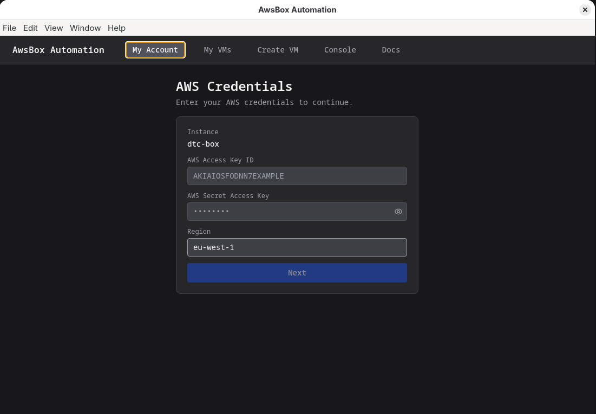

= AwsBoxAutomation
:toc: left
:toc-title: Contents
:toclevels: 2
:icons: font
:source-highlighter: highlight.js

An Electron + React desktop app for provisioning and managing an AWS VM "datacenter", and for hardening a fresh AWS account's security posture — all from a GUI, no AWS CLI required.

== Features

* *Account hardening* — delete root access keys, set up root MFA, create a root-login alarm, enforce an IAM password policy, block public S3 access, enable GuardDuty and IAM Access Analyzer, set billing/anomaly alerts and SMS security alerts
* *IAM user creation* — creates a scoped IAM user and deletes the temporary root access keys once it's active
* *MFA-gated sessions* — the IAM user's permanent key alone can't do anything privileged; an attached IAM policy requires a fresh MFA code (via `sts:GetSessionToken`) before privileged AWS calls succeed, and the app prompts for one whenever the current 4-hour session has expired
* *Credential gate* — validates AWS credentials against STS (`GetCallerIdentity`) before ever saving them; stored encrypted at rest via the OS keychain (`safeStorage`) where available
* *My VMs* — creates/starts/stops the AWS "datacenter" (VPC, subnet, security group, EC2 instance, DNS record)
* *Activity* — live viewer for the app's own log file
* *Docs* — renders the project's Markdown docs inside the app

== Requirements

[cols="1,2",options="header"]
|===
| Requirement | Version

| OS | Fedora 38+ (Linux)
| Node.js | 20+
| Python | 3.12 (for `vm/` provisioning scripts)
|===

See link:docs/DEVELOPMENT.md[docs/DEVELOPMENT.md] for full machine setup, including GitHub SSH access and the Python virtualenv.

== Quick Start

[source,bash]
----
cd app
npm install
npm start        # builds with Vite, then launches Electron
----

. On first launch, enter your AWS credentials — see link:docs/AWS_ACCOUNT_SETUP.md[docs/AWS_ACCOUNT_SETUP.md] for how to create the AWS account and generate root access keys
. Open *My Account* and work through the setup wizard: root MFA, IAM user creation, IAM user MFA + first session, then the optional alert/security cards
. Open *Create VM* to provision the datacenter, or *My VMs* to manage an existing one

NOTE: Root access keys are temporary — the app deletes them automatically once an IAM user is created. See link:docs/AWS_ACCOUNT_SETUP.md[docs/AWS_ACCOUNT_SETUP.md] for details.

== GUI Overview

[cols="1,3",options="header"]
|===
| Page | Description

| *My Account*
| Root security hardening, IAM user creation, billing/anomaly alerts — see link:docs/AWS_ACCOUNT_SETUP.md[docs/AWS_ACCOUNT_SETUP.md]

| *My VMs*
| Lists the datacenter instance with Start / Stop controls

| *Create VM*
| Provisions a new VPC, subnet, security group, EC2 instance, and DNS record

| *Activity*
| Live view of the app's log file

| *Docs*
| Renders this repo's Markdown docs in-app
|===

== Screenshots

.My Account — AWS credentials gate

Shown on first launch. Validates credentials against STS before saving; stored encrypted via the OS keychain where available.

== Documentation

* link:docs/AWS_ACCOUNT_SETUP.md[docs/AWS_ACCOUNT_SETUP.md] — creating and hardening the AWS account
* link:docs/DEVELOPMENT.md[docs/DEVELOPMENT.md] — machine setup and running the app locally
