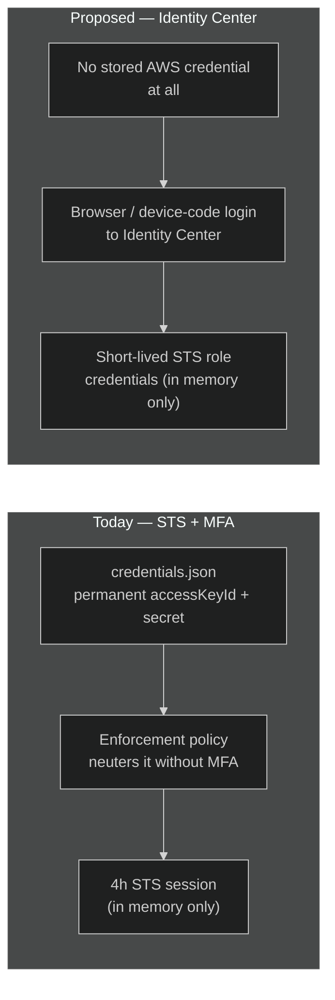
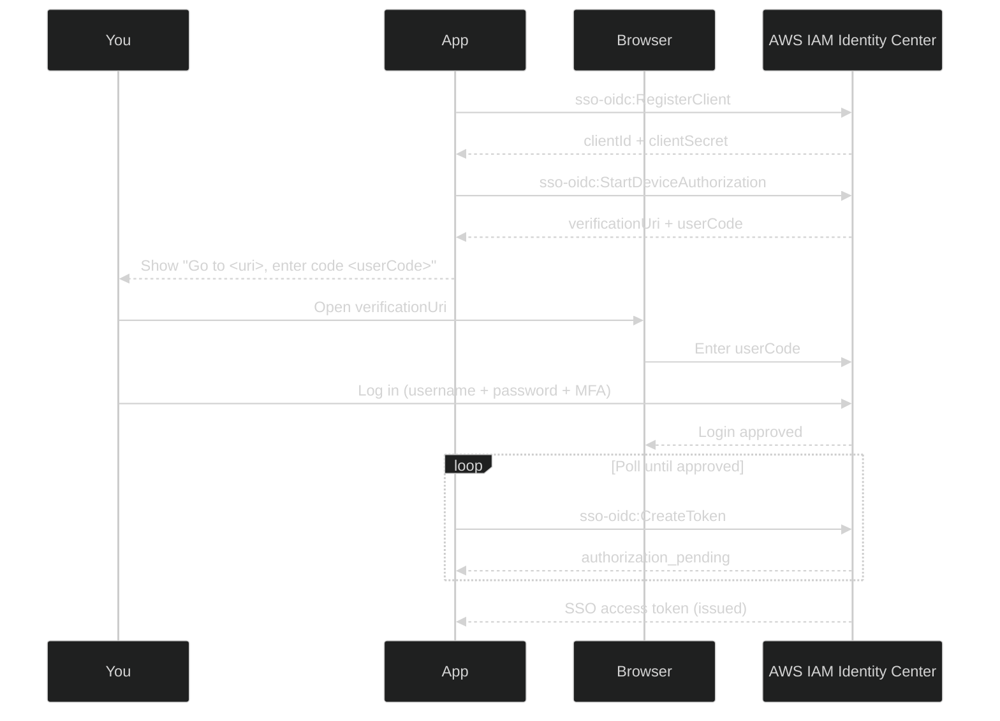
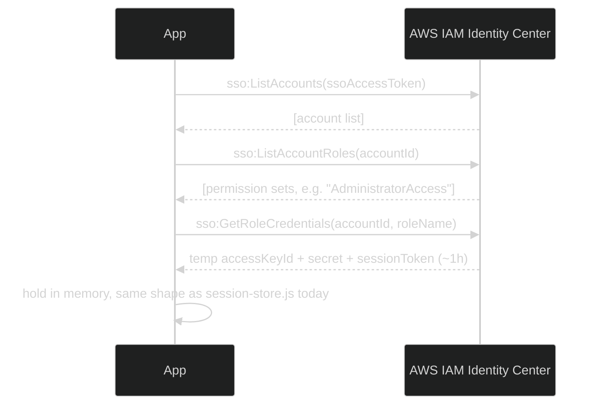
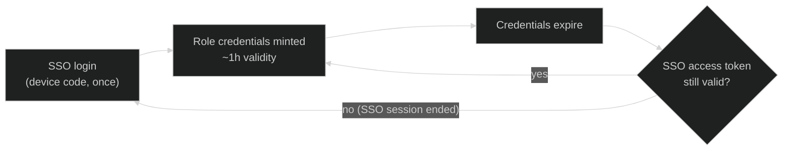

# Federated Login via AWS IAM Identity Center

> **Status: design proposal — not implemented.** This describes an
> alternative to the mechanism in
> [MFA_SESSION_MECHANISM.md](MFA_SESSION_MECHANISM.md), where the IAM
> admin user's permanent access key still lives on disk (just neutered
> without a live MFA session). Federation removes that stored key
> entirely. Nothing in this document exists in the codebase yet.

## The core difference

Both end states look similar — short-lived credentials, in memory only.
The difference is entirely upstream: today there's always *something*
long-lived sitting in `credentials.json` that a live MFA code activates.
With Identity Center, there is no AWS credential on disk between logins —
only the identity provider's own login session, which is external to AWS
entirely.

## Login flow — device authorization grant

Desktop apps can't easily host a browser-redirect callback, so this uses
the same flow the AWS CLI uses for `aws sso login` — a device code the
user enters in a separately-opened browser tab, while the app polls for
completion:

Note MFA is enforced by Identity Center itself at this step — the app
never sees a TOTP code, unlike the current mechanism where the app
collects the code directly and calls `sts:GetSessionToken`.

## Exchanging the SSO token for AWS credentials

The SSO access token from the flow above isn't an AWS credential — it
can't call EC2/IAM/etc. directly. It's exchanged for scoped, temporary
AWS credentials per account + permission set:

The resulting credential object is the same shape `session-store.js`
already produces (`accessKeyId` + `secretAccessKey` + `sessionToken`), so
every AWS SDK call site in `ipc-handlers.js` that already reads from
`getActiveCredentials()` would need no change in *how* it uses
credentials — only in *where they come from*.

## Session lifecycle

AWS SSO access tokens are themselves valid for a configurable window
(commonly 8–12 hours, set by the Identity Center administrator), so a
single device-code login can silently re-mint role credentials multiple
times without asking you to re-authenticate — only when the SSO session
itself expires does the full device-code flow repeat.

## What this requires on the AWS side

| Step | Detail |
| --- | --- |
| Enable Identity Center | One-time, account/organization level. Free — no extra cost beyond the resources it grants access to. |
| Create a permission set | Replaces the inline `AdministratorAccess` + MFA-enforcement policy currently attached to the IAM user — this becomes a Identity Center permission set instead. |
| Assign yourself | Add your Identity Center user (or the built-in directory) to that permission set for this account. |
| Enforce MFA | Configured once in Identity Center's authentication settings — applies to every login, not per-app. |

## What this requires in the app

- Remove `credentials.json`'s `accessKeyId`/`secretAccessKey` storage path entirely (or keep it as a legacy fallback during a transition period).
- New IPC handlers: `sso-login` (runs the device-code flow above, shows the code to the user), `sso-get-role-credentials` (the exchange step).
- Replace `session-store.js`'s `getActiveCredentials()` fallback-to-permanent-key logic with fallback-to-"prompt for SSO login" instead — there's no permanent key to fall back to anymore.
- `LoginPage.tsx`'s access-key-and-secret form goes away, replaced by a "Sign in with AWS" button and a modal showing the verification URL + code.
- Every one of the ~15 handlers that currently call `sessionStore.getActiveCredentials(store)` keeps working unchanged, since the credential *shape* returned is identical — only the thing populating the store changes.

## Comparison with what's implemented today

| | STS + MFA (implemented) | Identity Center federation (this proposal) |
| --- | --- | --- |
| Long-lived AWS credential on disk | Yes — neutered without MFA | None |
| MFA enforced by | This app's IAM policy | Identity Center's own login |
| Credential lifetime | 4h STS session | ~1h role credentials, refreshed under an 8–12h SSO session |
| AWS-side prerequisite | None beyond the IAM user | Identity Center must be enabled (Organization-level feature) |
| App-side effort | Implemented | New login UI, new IPC handlers, credential-store rewrite |
| Removes stolen-`credentials.json` risk entirely | No — key still exists, just inert | Yes — nothing sensitive at rest between logins |

## Why this isn't built yet

This is a genuine architectural change, not an incremental patch on the
current mechanism — it touches the credential store, the login UI, and
requires an AWS-side prerequisite (Identity Center) that a fresh personal
AWS account doesn't have enabled by default. It also sits in tension with
this project's current design constraint of always passing credentials
explicitly rather than relying on any provider-chain/profile-based
resolution — federation is exactly the pattern that constraint was written
to avoid, so adopting it would mean revisiting that constraint too.

## Glossary

| Acronym | Stands for | Meaning here |
| --- | --- | --- |
| AWS | Amazon Web Services | The cloud provider this whole app automates. |
| SSO | Single Sign-On | Log in once, use that session across multiple systems/accounts. AWS's SSO service was later renamed **IAM Identity Center** — the API namespaces (`sso`, `sso-oidc`) kept the old name. |
| OIDC | OpenID Connect | An identity layer on top of OAuth 2.0. `sso-oidc` is the API namespace used for the device-code login handshake (`RegisterClient`, `StartDeviceAuthorization`, `CreateToken`). |
| STS | Security Token Service | The AWS service that issues temporary credentials (access key + secret + session token). Used both by today's `GetSessionToken` mechanism and by Identity Center's `GetRoleCredentials` under the hood. |
| IAM | Identity and Access Management | AWS's system for users, roles, and permission policies. The "IAM admin user" in this app, and the "IAM" in "IAM Identity Center," both refer to this. |
| MFA | Multi-Factor Authentication | A second proof of identity beyond a password — a 6-digit code from an authenticator app (TOTP) in this app's case. |
| TOTP | Time-based One-Time Password | The specific MFA code format used here — a 6-digit code that rotates every 30 seconds, generated by an authenticator app from a shared secret. |
| IPC | Inter-Process Communication | How this Electron app's renderer (UI) talks to its main process (where AWS SDK calls actually happen) — e.g. the `sso-login` handler proposed above. |
