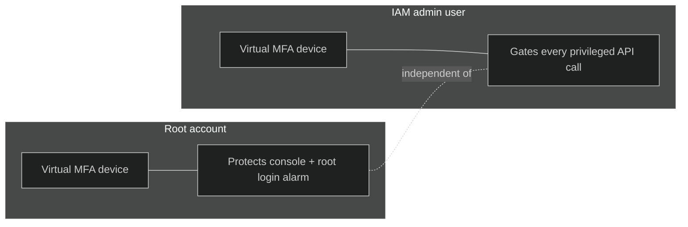
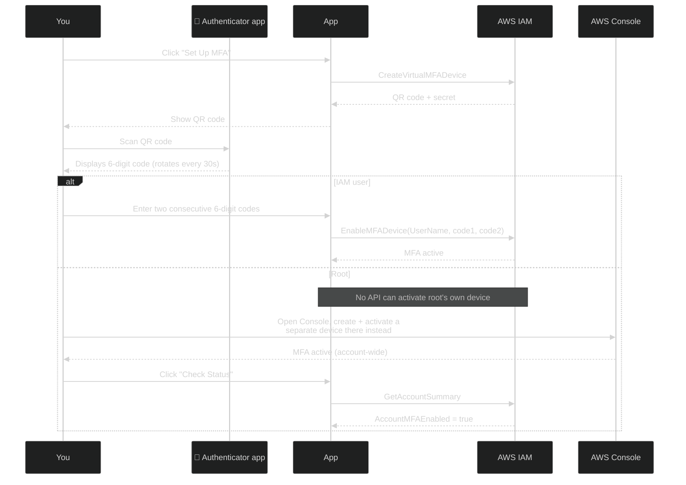
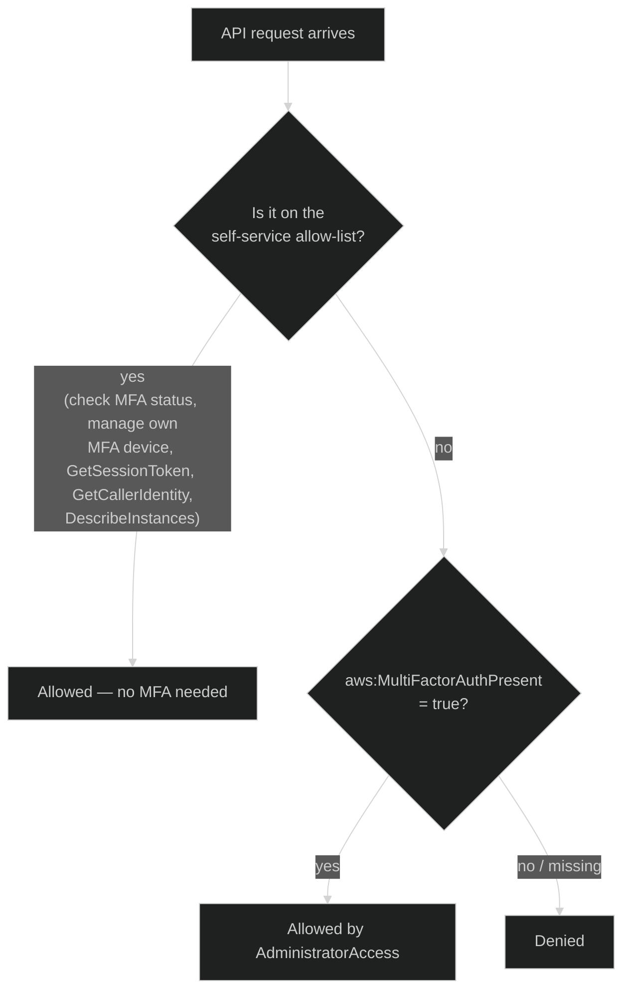
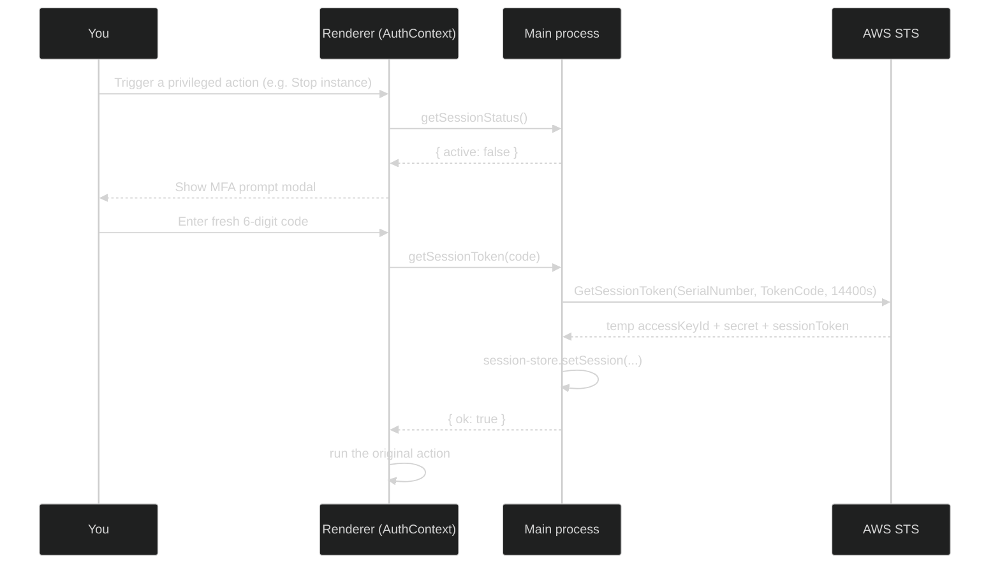
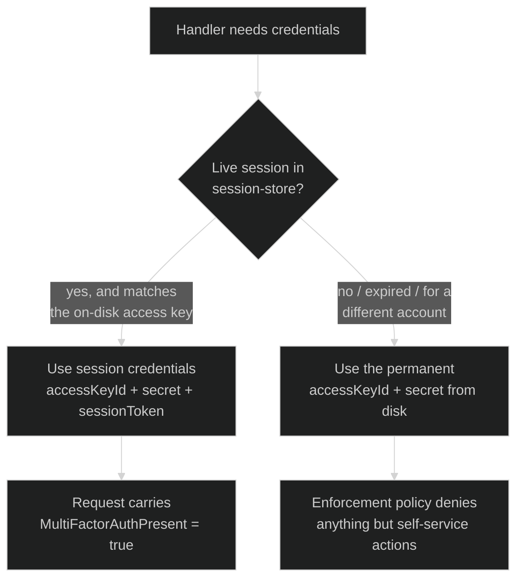
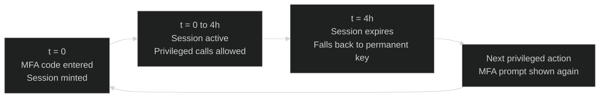

# MFA & Session Mechanism

How this app protects root and the IAM admin user with MFA, and how the IAM
user's permanent access key is neutered without a live session. This is a
deep-dive on the mechanism — see [AWS_ACCOUNT_SETUP.md](AWS_ACCOUNT_SETUP.md)
for the setup wizard walkthrough.

## The two layers

Root MFA and IAM user MFA both start the same way (device creation + QR
code) but **diverge at activation**, and do different jobs besides. Root MFA
just protects the root login itself. IAM user MFA is paired with an
enforcement policy that makes the day-to-day permanent access key powerless
on its own — that's the part this document focuses on.

## 📱 Enrolling a virtual MFA device

`mfaCard` (root) and `iamMfaCard` (IAM user) in `AccountPage.tsx` share the
device-creation step, then split: `iam:EnableMFADevice` requires a real IAM
`UserName`, which root doesn't have — no API can activate root's own device
(confirmed against the SDK's model and live testing; `sts:AssumeRoot`'s
fixed task-policy list doesn't cover MFA either), so root activation only
exists in the AWS Console:

The Console flow creates its own virtual MFA device, independent from the
one the app created — you end up with an extra, unassigned device (and a
matching unused authenticator app entry) that's harmless but can be deleted
later if you want to tidy up. `Check Status` reads `AccountMFAEnabled`,
which is account-wide, not tied to which specific device activated it.

## The enforcement policy — why a leaked key isn't enough

`create-iam-user` attaches an inline policy
([mfa-enforcement-policy.js](../app/electron/mfa-enforcement-policy.js))
alongside `AdministratorAccess`. IAM always lets an explicit `Deny` win over
any `Allow`, so this single policy turns "admin" into "admin, only with a
live MFA session":

The subtle bit: `aws:MultiFactorAuthPresent` only exists as a request
attribute on **STS temporary credentials**. A request signed with the plain
permanent access key carries no such attribute at all — it isn't `false`,
it's *absent*. The policy uses `BoolIfExists` (not `Bool`) specifically so
"absent" is treated as "false," otherwise a permanent-key request would slip
past the Deny entirely.

**Net effect:** the permanent access key saved to disk in step 2 of setup
can, by itself, only check its own status and start a session — nothing
else — until a live MFA code is supplied.

## Minting a session

The session lives in `session-store.js`, **in memory only** — never written
to `credentials.json`. A 4-hour token gains nothing from disk persistence,
and persisting it would just be a second thing to leak. Restarting the app
loses the session; the next privileged action re-prompts for a fresh code.

## Which credentials actually get used

Every privileged IPC handler resolves credentials the same way before
calling an AWS SDK client:

This is `getActiveCredentials()` in `session-store.js` — it falls back to
the permanent key automatically if there's no session, the session expired,
or credentials.json now points at a different account than the session was
minted for.

## Session lifecycle over time

At the 4-hour mark the session silently expires. Nothing breaks — the next
privileged action just re-triggers the MFA prompt shown above, and read-only
actions (like the My VMs status view) keep working the whole time regardless
of session state, since they're on the enforcement policy's allow-list.

## What this defends against

| Threat | Outcome |
| --- | --- |
| `credentials.json` read off disk | Attacker gets a permanent key that can only check status / start a session — no live MFA code, no damage. |
| App left running, no active session | Next privileged action re-prompts for MFA before doing anything. |
| Stale session after switching AWS accounts | `getActiveCredentials()` detects the access-key mismatch and falls back to the (harmless-without-MFA) permanent key. |

## What this doesn't do

The permanent key still exists on disk — STS `GetSessionToken` requires
*something* to authenticate the bootstrap call with, so it can't be
eliminated outright without a different architecture (federated login via
AWS IAM Identity Center, which issues no long-lived key at all). That's a
larger change than this mechanism and isn't implemented here.

## Glossary

| Acronym | Stands for | Meaning here |
| --- | --- | --- |
| AWS | Amazon Web Services | The cloud provider this whole app automates. |
| MFA | Multi-Factor Authentication | A second proof of identity beyond a password/access key — a 6-digit code from an authenticator app (TOTP) in this app's case. |
| TOTP | Time-based One-Time Password | The specific MFA code format used here — a 6-digit code that rotates every 30 seconds, generated by an authenticator app from a shared secret. |
| IAM | Identity and Access Management | AWS's system for users, roles, and permission policies. "Root" and the "IAM admin user" are both IAM concepts, though root itself sits outside IAM. |
| STS | Security Token Service | The AWS service that issues the temporary credentials (access key + secret + session token) minted by `GetSessionToken`. |
| IPC | Inter-Process Communication | How this Electron app's renderer (UI, e.g. `AccountPage.tsx`) talks to its main process (`ipc-handlers.js`, where AWS SDK calls actually happen). |
| QR (code) | Quick Response code | The scannable barcode shown during MFA enrollment — it encodes the shared secret so your authenticator app can start generating matching TOTP codes. |
